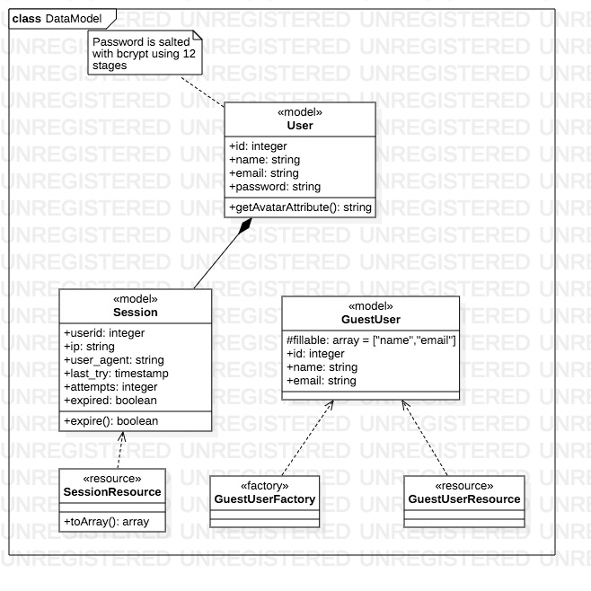

# Prueba de Marival para aplicar como Full Stack Developer

    En esta prueba tuve que aprender Vue 2.x y Laravel 5.5.x

## Configurar entorno de desarrollo

Para la configuración del entorno de pruebas se usa Docker con el servidor de artisan, para las pruebas de la aplicación.

Habilitar servidor: `php artisan serve --port 80`

Para docker es necesario ejecutar los siguientes pasos:

1. Construir una imagen del archivo `Dockerfile`.
2. Construir un contenedor de la imagen, para que corra en el fondo (background).
3. Crear la base de datos en el contenedor.

```bash
cd database/deploy
docker build -t marival-db:latest .
docker run --name dbserver -d -p 3306:3306 marival-db:latest
mysql -u root -h 127.0.0.1 -P 3306 -p <<EOF
create database marivaltest_db;
EOF
```

## Modelo de datos

<p align="center">
    
</p>

El modelo de datos se compone de las siguientes entidades:

1. Usuarios: Son administradores del sistema que pueden ejecutar operaciones en el mismo.
2. Session: Registro de las sessiones del usuario generados al autenticarse.
3. GuestUser: Son usuarios que pueden ser manipulados por el usuario administrador.

## Rutas del proyecto

1. **login:** muestra una vista para que el usuario se autentique.
2. **dashboard/users:** muestra una vista para administrar los usuarios de la aplicación.
3. **dashboard/sessions:** muestra una vista con las sessiones del usuario.
4. **dashboard/profile:** muestra la información básica de un usuario, que puede ser editada por el mismo. 

## API REST

**Endpoint:** /api/auth

Ruta|Mètodo|Descripción
--|--|--
login|POST|autentica a un usuario en la aplicación siempre y cuando sus credenciales sean correctas.
logout|PUT|termina la sesión de un usuario en la aplicación, utilizando el `token` de sesión.

**Endpoint:** /api/auth/sessions

Ruta|Método|Descripción
--|--|--
/|GET|Obtiene todas las sesiones del usuario actual por su unico identificador, usando el SessionStorage de Laravel.

**Endpoint:** /api/profile

Ruta|Método|Descripción
--|--|--
/{id}/update|PUT|Actualiza el perfil del usuario

**Endpoint:** /api/users

Ruta|Método|Descripción
--|--|--
/|GET|Obtiene todos los usuarios.
/|POST|Crea un nuevo usuario.
/{id}/update|PUT|Actualiza un usuario.
/{id}|GET|Obtiene un usuario por su único identificador.
/{id}/del|DEL|Elimina un usuario por su único identificador.

## Protocolo de seguridad un Fork de OAuth2

OAuth es un estandar de autenticación para aplicaciones de terceros, el cual consiste en un token y un identificador único que son generados por la aplicación que proporciona el accesso, con el objetivo de integrar de manera segura plataformas, sin necesidad de exponer información.

**La justificación de esta propuesta, es que los recursos del usuario como su perfil o sesiones, al ser manejados, con el único identificador del usuario, en un API pueden ser modificados por cualquiera que posea ese identificador**

En un escenario ficticio el atacante tomaría los identificadores de los usuarios, mediante XSS (Cross Site Scripting) u otra técnica para robar datos de un cliente, al obtener el mismo identificador podría el atacante usarlo en el API para robar o manipular información.

El diseño de este protocolo consiste en cuatro fases

1. El usuario inicia una sesión válida.
2. Se le genera un token de sesión tomando un timestamp actual y un número aleatorio en el rango de cero a 1000.
3. Cuando se autentica se retorna el token de sesión que es almacenado en el `localStorage`, para el usuario actual.
4. Al enviar cualquier solicitud, el token de sesión se usa para realizar las operaciones correspondientes del usuario como: actualizar perfil, etc.

<p align="center">
    
</p>

## Escalabilidad del proyecto

Este proyecto puede ser escalado mediante una arquitectura N-Tier (Multicapa) usando los siguientes componentes:

1. Un proxy inverso: Distribuye la carga de haciendo las solicitudes al servidor del API, lo cual hace posible el cacheo de las conexiones, además que aporta una capa de seguridad, ya que la composición o su conjunto de tecnologías permaneceria oculto.
2. Servidor del API REST: Este servidor tiene la función de manejar toda la lógica del sistema, permitiendo construir clientes híbridos dirigidos a un mismo punto.
3. Servidor de base de datos: Es usado única y exclusivamente para gestionar las bases de datos que conforman el proyecto.
4. Servidor Web (Cliente Ligero): Este servidor se encarga de mostrar las vistas al cliente final, mediante la obtención de los datos preformateados a través del servidor del API.

<p class="center">
    
</p>

## Producto final

Proyecto montado en [Heroku](https://marival-test-ds0.herokuapp.com/)
